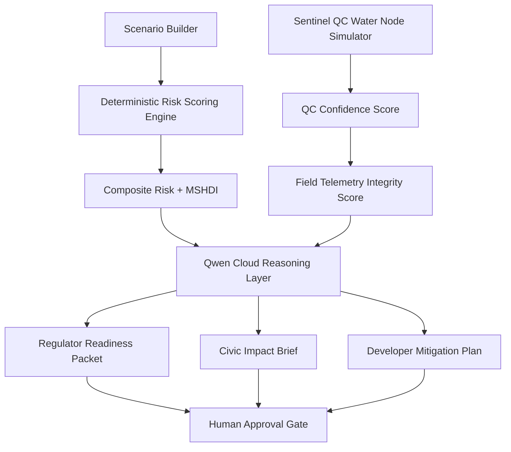

# HydroCompute Architecture



## Core Flow

```text
Scenario → Score → Qwen Analysis → Stakeholder Outputs → Human Approval
```

## Expanded Flow

```text
Scenario → Telemetry Simulation → QC Confidence → HydroCompute Score → Qwen Explanation → Human Approval
```

## Design Principle

HydroCompute separates deterministic calculation from language-model reasoning. Numeric scores remain auditable. Qwen handles interpretation, contradiction detection, stakeholder-specific outputs, and human-review summaries.
