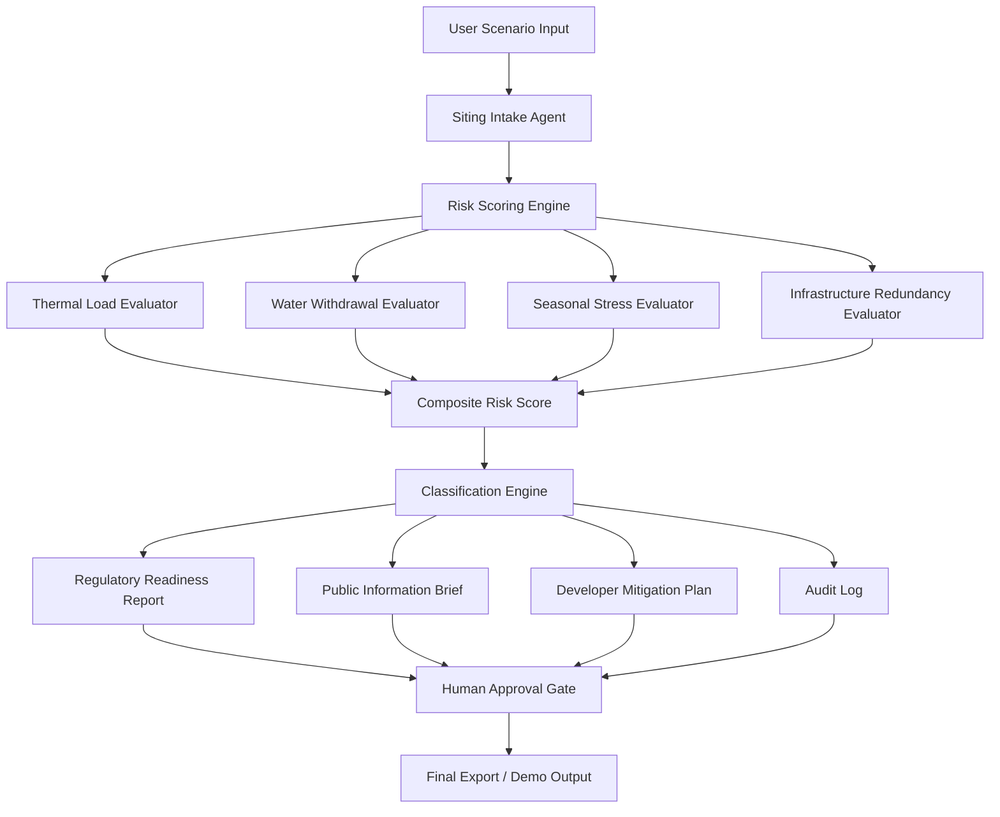

# HydroCompute: Sentinel

**Water–Energy–Food–Compute intelligence for sustainable AI infrastructure siting.**

HydroCompute: Sentinel is an AI infrastructure readiness system that helps regions evaluate where hyperscale compute can grow without destabilizing water systems, energy grids, agricultural resilience, ecological health, or public trust.

The system is designed for the **Global AI Hackathon Series with Qwen Cloud** under **Track 4: Autopilot Agent**.

---

## Project Summary

AI infrastructure is expanding rapidly, but most siting conversations still focus on land availability, power access, tax incentives, and fiber connectivity. HydroCompute: Sentinel reframes the problem through a broader systems lens:

> Can this watershed, grid, agricultural economy, regulatory system, and community safely absorb the next unit of AI compute?

HydroCompute evaluates proposed data center facilities against water, thermal, energy, agricultural, infrastructure, and regulatory constraints. It produces stakeholder-specific outputs for developers, regulators, investors, utilities, and the public.

The Ohio River can be used as one demonstration case, but the system is designed for **major rivers, lakes, reservoirs, estuaries, aquifers, and other water systems** that could become central to AI data center expansion.

---

## Core Concept

HydroCompute: Sentinel is not simply a water-use calculator.

It is a **Water–Energy–Food–Compute decision intelligence system**.

It evaluates:

* Water dependency
* Thermal discharge risk
* Cooling architecture
* Seasonal low-flow and heat stress
* Energy and grid burden
* Agricultural water security
* Ecological sensitivity
* Infrastructure redundancy
* Regulatory readiness
* Community and public-trust risk
* Regional net benefit

The goal is to help public and private decision-makers understand whether a proposed AI infrastructure project is a sustainable buildout candidate, a conditional fit, a regulatory stress case, or an unacceptable resource allocation.

---

## Hackathon Track

**Track:** Autopilot Agent

HydroCompute fits the Autopilot Agent track because it automates a complex real-world workflow:

1. Intake a proposed AI/data center facility scenario.
2. Normalize facility and watershed assumptions.
3. Score the project against risk dimensions.
4. Detect missing data and contradictory claims.
5. Generate a regulator-facing readiness report.
6. Generate a public-facing impact brief.
7. Generate a developer-facing mitigation plan.
8. Require human review before final export.

---

## Problem

AI data centers are becoming a new class of regional industrial load.

They require:

* Continuous electricity
* Cooling capacity
* Water planning
* Heat rejection management
* Grid interconnection
* Regulatory approval
* Community trust

Traditional siting workflows often under-model the cumulative pressure that concentrated compute facilities can create across shared water and energy systems.

The issue is not only whether a region has enough water in the abstract. The deeper issue is whether a specific water system can safely absorb:

* heat rejection
* water withdrawal
* consumptive use
* discharge impacts
* seasonal stress
* cumulative data center clustering
* competing agricultural and municipal demands

HydroCompute addresses this gap by providing a structured, transparent, and stakeholder-aware workflow for AI infrastructure readiness analysis.

---

## What HydroCompute Does

HydroCompute: Sentinel currently supports a prototype workflow that:

* Accepts a proposed facility scenario
* Calculates a composite infrastructure risk score
* Calculates a preliminary Maximum Sustainable Hyperscale Density Index
* Classifies the scenario into a risk band
* Generates a regulatory readiness report
* Generates a public information brief
* Generates a developer mitigation plan
* Flags missing data and high-risk assumptions
* Provides a framework for future Qwen-powered reasoning and cloud deployment

---

## Key Outputs

### 1. Composite Infrastructure Risk Score

A weighted score based on:

* Thermal Load Risk
* Water Withdrawal Density
* Seasonal Overlap Risk
* Infrastructure Redundancy Risk

### 2. Risk Classification

The system classifies projects into:

|  Score | Classification    | Meaning                           |
| -----: | ----------------- | --------------------------------- |
|   0–40 | Safe              | Strong buildout candidate         |
|  40–70 | Managed Risk      | Buildout possible with mitigation |
| 70–100 | Regulatory Stress | High review or permitting burden  |
|   100+ | Overload          | Redesign, relocate, or defer      |

### 3. MSHDI

**Maximum Sustainable Hyperscale Density Index**

A planning indicator that estimates how concentrated hyperscale compute can become near a water body before ecological, thermal, infrastructure, or regulatory pressure becomes excessive.

### 4. Regulator Readiness Report

A structured technical report for permitting and environmental review.

### 5. Public Information Brief

A plain-language community-facing explanation of the proposal, risks, missing information, and questions residents should ask.

### 6. Developer Mitigation Plan

A practical plan for reducing risk through better cooling design, infrastructure redundancy, seasonal operating limits, monitoring, water reuse, and community-benefit commitments.

---

## Companion Modules

HydroCompute is structured as a core engine with companion modules.

### Core Engine

**HydroCompute Sentinel**

Evaluates proposed AI infrastructure projects against water, heat, energy, seasonal, and regulatory constraints.

### Companion Module 1

**Permit Readiness Packet**

Generates regulator-facing summaries, missing document lists, environmental review questions, and permitting readiness language.

### Companion Module 2

**Civic Impact Brief**

Translates technical results into plain-language public information for communities, hearings, public comments, and local decision-making.

### Companion Module 3

**Developer Mitigation Planner**

Provides developer-facing recommendations to reduce risk before a project enters formal review.

### Companion Module 4

**Claim-Risk Analyzer**

Flags contradictions in a proposal, such as:

* “Low water dependency” paired with evaporative cooling
* “Minimal grid impact” paired with hundreds of megawatts of continuous load
* “Sustainable design” without water reuse or thermal discharge details
* “Permit ready” while critical hydrology or discharge data is missing

### Companion Module 5

**Human Approval Gate**

Ensures final reports are marked as draft outputs until reviewed by a human decision-maker.

---

## System Architecture



---

## Agent Design

HydroCompute is designed around specialized agent modules.

### Siting Intake Agent

Normalizes the proposed facility data and identifies missing values.

### Hydrology Agent

Evaluates water source assumptions, withdrawal exposure, low-flow vulnerability, and watershed carrying capacity.

### Thermal Risk Agent

Evaluates facility heat rejection, seasonal river temperature, discharge sensitivity, and thermal stress.

### Grid Pressure Agent

Evaluates facility megawatt demand, infrastructure redundancy, backup power, and regional energy burden.

### Regulatory Readiness Agent

Generates permitting and environmental review language.

### Public Brief Agent

Converts technical results into plain-language community information.

### Mitigation Agent

Recommends lower-risk cooling, monitoring, reuse, resilience, and community-benefit measures.

### Human Review Agent

Controls final report export and prevents unchecked automated conclusions.

---

## Current Prototype

The current prototype is written in Python and includes:

* Local deterministic scoring
* Scenario input handling
* Risk classification
* MSHDI estimation
* Markdown report generation
* Public brief generation
* Developer mitigation plan generation
* Sample watershed data
* Modular agent folder structure

No external API key is required to run the current local prototype.

---

## Planned Qwen Cloud Integration

The current local prototype is designed to be upgraded with Qwen Cloud.

Planned Qwen-powered functions:

* Interpret ambiguous siting proposals
* Extract structured data from uploaded planning documents
* Detect contradictions in developer claims
* Generate regulator-facing readiness language
* Generate public-facing community summaries
* Produce mitigation plans
* Summarize scenario history
* Support human-in-the-loop review
* Explain risk classifications in natural language

The Qwen integration should use an OpenAI-compatible API pattern so the reasoning layer can be swapped cleanly into the existing architecture.

---

## Scoring Model

The prototype uses the following composite risk model:

```text
Composite Risk Score =
Thermal Load Risk × 0.35
+ Water Withdrawal Density × 0.25
+ Seasonal Overlap Risk × 0.20
+ Infrastructure Redundancy Risk × 0.20
```

### Risk Inputs

| Input                     | Meaning                                                            |
| ------------------------- | ------------------------------------------------------------------ |
| Facility MW               | Proposed compute load                                              |
| Cooling Type              | Once-through, evaporative, hybrid, or dry                          |
| Season                    | Summer, winter, spring, autumn/fall                                |
| Infrastructure Redundancy | Resilience of pumps, intake, cooling, backup systems               |
| Water Body / Location     | River, lake, reservoir, estuary, aquifer, or regional water system |

### Cooling Risk Defaults

| Cooling Type | Water Risk |
| ------------ | ---------: |
| Once-through |         90 |
| Evaporative  |         70 |
| Hybrid       |         50 |
| Dry          |         10 |

These are prototype assumptions for demo purposes and should be replaced or calibrated with empirical data in production.

---

## Example Demo Scenario

A user evaluates a proposed facility:

```text
Location: General major river system
Facility Size: 400 MW
Cooling Type: Evaporative
Season: Summer
Infrastructure Redundancy: 50%
```

HydroCompute returns:

```text
Composite Risk Score: 71.5
Classification: Regulatory Stress
MSHDI: 120.0
```

The system then generates:

* Regulatory Readiness Report
* Public Information Brief
* Developer Mitigation Plan

---

## Run Locally

### Requirements

* Python 3.9+
* No external API key required for the local prototype

### Clone the repository

```bash
git clone https://github.com/YOUR-USERNAME/hydrocompute-sentinel.git
cd hydrocompute-sentinel
```

### Run demo scenario

```bash
python hydrocompute/scripts/run_demo.py \
  --facility_mw 400 \
  --cooling_type evaporative \
  --season summer \
  --location "General River System" \
  --infra_redundancy 50
```

### Run lower-risk scenario

```bash
python hydrocompute/scripts/run_demo.py \
  --facility_mw 120 \
  --cooling_type hybrid \
  --season spring \
  --location "Reservoir-Adjacent Compute Site" \
  --infra_redundancy 80
```

### Run high-risk scenario

```bash
python hydrocompute/scripts/run_demo.py \
  --facility_mw 600 \
  --cooling_type once-through \
  --season summer \
  --location "Low-Flow River Segment" \
  --infra_redundancy 30
```

---

## Repository Structure

```text
hydrocompute/
  README.md
  LICENSE
  data/
    river_segments.csv
  agents/
    __init__.py
    risk_scoring.py
    report_generator.py
  scripts/
    run_demo.py
  reports/
    regulatory_report.md
    public_brief.md
    mitigation_plan.md
```

---

## Data Model

The prototype supports river and water-body segment data.

Example fields:

```text
segment_id
river_name
state
country
mean_flow_cfs
low_flow_cfs
baseline_temp_c
summer_temp_c
ecological_sensitivity_score
infrastructure_capacity_score
regulatory_jurisdiction
```

Future versions can expand this model to include:

* Reservoir storage
* Estuary salinity sensitivity
* Aquifer recharge limits
* Agricultural withdrawal demand
* Municipal water demand
* Utility interconnection capacity
* Grid carbon intensity
* Existing data center density
* Regulatory discharge limits
* Public-trust and community-benefit indicators

---

## Water–Energy–Food–Compute Framework

HydroCompute uses the **Water–Energy–Food–Compute** framework.

### Water

Measures withdrawal, consumption, discharge, drought sensitivity, source type, and water-system carrying capacity.

### Energy

Measures facility load, grid stress, renewable alignment, backup generation, energy penalty from cooling, and regional reliability.

### Food / Agriculture

Measures irrigation exposure, agricultural water competition, drought vulnerability, crop-value risk, and rural economic implications.

### Compute

Measures data center megawatt load, clustering density, cooling architecture, regional compute strategy, and long-term infrastructure value.

### Ecology

Measures thermal discharge, dissolved oxygen sensitivity, aquatic habitat risk, seasonal temperature stress, and ecological thresholds.

### Public Trust

Measures disclosure quality, community benefit, public hearing readiness, missing data, and likely permit friction.

---

## Sustainability Fit Score

Future versions will include a broader sustainability score:

```text
Sustainability Fit Score =
Water Stewardship × 0.25
+ Thermal Ecosystem Safety × 0.25
+ Energy / Carbon Alignment × 0.20
+ Climate Resilience × 0.15
+ Regulatory / Community Readiness × 0.15
```

### Sustainability Bands

| Score | Classification        | Meaning                                 |
| ----: | --------------------- | --------------------------------------- |
|  0–30 | Strong Fit            | Sustainable buildout candidate          |
| 31–55 | Conditional Fit       | Viable with mitigation                  |
| 56–75 | Sustainability Stress | High environmental or permitting burden |
|   76+ | Poor Fit              | Redesign, relocate, or defer            |

---

## WEFC-R Score

The long-term platform will also include a **Water–Energy–Food–Compute Resilience Score**.

```text
WEFC-R =
Watershed Capacity × 0.25
+ Agricultural Water Security × 0.20
+ Energy Reliability × 0.20
+ Thermal-Ecological Safety × 0.20
+ Regional Net Benefit × 0.15
```

### WEFC-R Bands

| Score | Classification           | Meaning                                                     |
| ----: | ------------------------ | ----------------------------------------------------------- |
|  0–30 | Resilient Fit            | Strong candidate for sustainable buildout                   |
| 31–55 | Conditional Fit          | Viable with mitigation and monitoring                       |
| 56–75 | Cross-Sector Stress      | Requires redesign, restrictions, or stronger public benefit |
|   76+ | Unsustainable Allocation | Avoid, defer, or fundamentally restructure                  |

---

## Why This Matters

AI infrastructure is becoming a defining test of regional economic sustainability.

The same watersheds that support agriculture, ecosystems, cities, energy systems, and public health are now being asked to support large-scale compute. HydroCompute helps regions determine whether AI infrastructure can be built without destabilizing the resource systems that make long-term economic resilience possible.

The project is designed to support:

* Developers seeking better siting decisions
* Regulators reviewing environmental and infrastructure pressure
* Utilities planning for future load
* Investors evaluating project risk
* Communities seeking plain-language transparency
* Researchers studying sustainable AI infrastructure
* Policymakers designing compute governance frameworks

---

## Human-in-the-Loop Safety

HydroCompute is a decision-support system, not an automatic permitting authority.

The system is designed to:

* Separate known data from assumptions
* Flag missing information
* Explain score drivers
* Require human review before final export
* Avoid final legal or regulatory determinations
* Support transparent decision-making
* Preserve auditability

All outputs should be treated as draft decision-support artifacts until reviewed by qualified experts, regulators, engineers, or public-sector decision-makers.

---

## Limitations

The current prototype uses simplified scoring and synthetic/demo data.

It does not yet include:

* Live hydrological feeds
* Live water temperature monitoring
* Real-time utility interconnection data
* Full Clean Water Act permitting logic
* Verified agricultural water-use data
* Real regulatory thresholds for every jurisdiction
* Full GIS watershed mapping
* Production Qwen Cloud integration
* Formal environmental impact modeling

The prototype is intended to demonstrate the workflow, architecture, scoring logic, and report-generation system.

---

## Roadmap

### Phase 1: Hackathon MVP

* Deterministic scoring model
* Scenario builder
* Report generation
* Public brief generation
* Mitigation planning
* Sample watershed dataset
* Devpost-ready demo

### Phase 2: Qwen Cloud Agent Layer

* Proposal document parsing
* Natural-language reasoning
* Contradiction detection
* Report drafting
* Public-comment generation
* Human review workflow

### Phase 3: Data Expansion

* USGS-style water data
* NOAA-style climate and temperature data
* Agricultural water-use indicators
* Utility and grid capacity indicators
* Regulatory threshold database
* Multi-watershed data library

### Phase 4: Dashboard

* Watershed compute zoning map
* Scenario comparison
* Cooling architecture comparison
* Sustainability scorecard
* Regulatory readiness dashboard
* Public transparency view

### Phase 5: Policy and Enterprise Platform

* Developer workflow portal
* Regulator workflow portal
* Investor risk memo generator
* Utility planning module
* Public hearing brief generator
* Regional compute governance toolkit

---

## Built With

* Python
* Markdown
* CSV data templates
* Modular agent architecture
* Deterministic scoring logic
* Report generation
* Water–Energy–Food–Compute framework
* Devpost
* GitHub
* Planned Qwen Cloud integration
* Planned Alibaba Cloud deployment

---

## Project Status

Current status: **Hackathon prototype / MVP in progress**

Completed:

* Core project structure
* Risk scoring module
* MSHDI prototype
* Report generator
* Public brief generator
* Developer mitigation planner
* Demo script
* Sample water body dataset
* README documentation

In progress:

* Qwen Cloud reasoning layer
* Web dashboard
* Architecture diagram
* Alibaba Cloud deployment proof
* Public demo video
* Devpost submission package

---

## License

This project is licensed under the MIT License.

See the `LICENSE` file for details.

---

## Disclaimer

HydroCompute: Sentinel is a prototype decision-support tool. It does not provide legal, engineering, environmental, financial, or regulatory advice. Outputs are generated for research, planning, demonstration, and educational purposes only. Final decisions about data center siting, permitting, environmental compliance, or infrastructure development should be made by qualified professionals and relevant public authorities.

---

## Author

Built by **Sierra Warren / Sierra Warren Developments** as part of the Global AI Hackathon Series with Qwen Cloud.

HydroCompute: Sentinel is part of a broader effort to design intelligent infrastructure systems for sustainable AI, water governance, ecological resilience, public-sector transparency, and responsible regional development.
